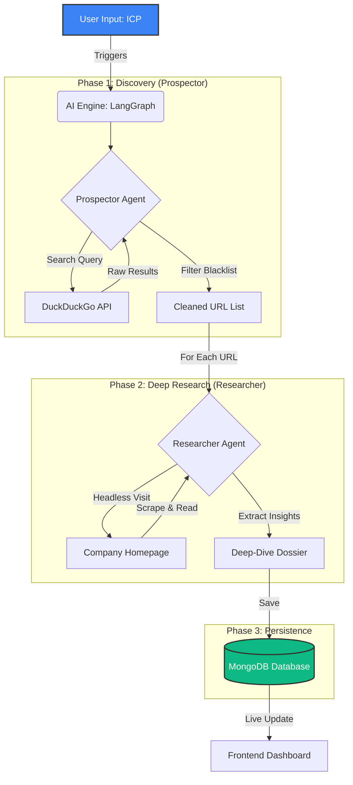

# The Revenue Engine: Autonomous Lead Generation SaaS

## 🚀 Overview
**The Revenue Engine** is a "Deep Tech" Lead Generation platform designed to automate the labor-intensive parts of the sales process: **Prospecting**, **Research**, and **Data Enrichment**.

Unlike traditional tools that just give you a static list of emails, this system employs **Autonomous AI Agents** to:
1.  **Find** companies matching your Ideal Customer Profile (ICP) using real-time search.
2.  **Visit** their actual websites (using headless browsers) to "read" their value proposition.
3.  **Generate** a "Deep-Dive Dossier" with key insights, technologies used, and context for outreach.
4.  **Save** all data to a persistent database for your CRM pipeline.

## 🏗️ Architecture
The system follows a **Hybrid Microservices** architecture to ensure scalability and separation of concerns:

### 🧠 AI Workflow Logic


### 1. 🧠 AI Engine (`/ai_engine`)
*   **Tech**: Python 3, LangGraph, FastAPI, Playwright, DuckDuckGo.
*   **Role**: The "Brain". It runs the agentic workflows.
*   **Agents**:
    *   `Prospector`: Searches the web for high-fidelity leads, filtering out aggregators and junk results.
    *   `Researcher`: autonomously navigates to company homepages, scrapes content, and extracts strategic insights.

### 2. 🔌 Backend Core (`/server`)
*   **Tech**: Node.js, Express, MongoDB, Winston Logger.
*   **Role**: The "Nervous System".
*   **Features**:
    *   **Data Persistence**: Stores leads and dossiers in MongoDB.
    *   **API Gateway**: Proxies requests between the Frontend and AI Engine.
    *   **Logging**: Maintains robust audit trails of all agent actions.

### 3. 💻 Frontend Command Center (`/client`)
*   **Tech**: Next.js 16, React 19, Tailwind CSS, Shadcn UI.
*   **Role**: The User Interface.
*   **Features**:
    *   Real-time "Kanban" style dashboard.
    *   Live updates of identified leads.
    *   Visualization of Deep-Dive Reports.

## 🛠️ Prerequisites
*   **Node.js** (v18+)
*   **Python** (v3.10+)
*   **MongoDB** (running locally or a URI)

## 🚀 Getting Started

### 1. Clone the Repository
```bash
git clone https://github.com/AJBIKI/Lead_generation_agent.git
cd Lead_generator_agent
```

### 2. Setup the AI Engine
```bash
cd ai_engine
python -m venv venv
# Windows
.\venv\Scripts\activate
# Mac/Linux
# source venv/bin/activate

pip install -r requirements.txt
playwright install chromium
```
*Note: Create a `.env` file in `ai_engine` if you plan to use OpenAI/Anthropic models in the future.*

### 3. Setup the Backend
```bash
cd ../server
npm install
# Ensure MongoDB is running
```

### 4. Setup the Frontend
```bash
cd ../client
npm install
```

## 🏃‍♂️ Running the Application
You need to run all three services simultaneously (in separate terminals):

**Terminal 1 (AI Engine)**
```bash
cd ai_engine
python main.py
# Runs on localhost:8000
```

**Terminal 2 (Backend)**
```bash
cd server
node index.js
# Runs on localhost:5000
```

**Terminal 3 (Frontend)**
```bash
cd client
npm run dev
# Runs on localhost:3000
```

## 🎯 Usage
1.  Open your browser to `http://localhost:3000`.
2.  In the **Campaign Configuration** input, describe your target:
    *   *Example*: "Series A Fintech startups in London"
    *   *Example*: "AI companies building autonomous agents in San Francisco"
3.  Click **Start Campaign**.
4.  Watch as the AI Agents populate the columns with live data.

## 🔮 Future Roadmap
*   **recursive Crawling**: Agents that click deeper into "About Us" and "Team" pages.
*   **LLM Parsing**: replacing raw text extraction with structured JSON parsing (via Llama 3 or GPT-4).
*   **Email Automation**: Auto-drafting personalized emails based on the Dossier.
